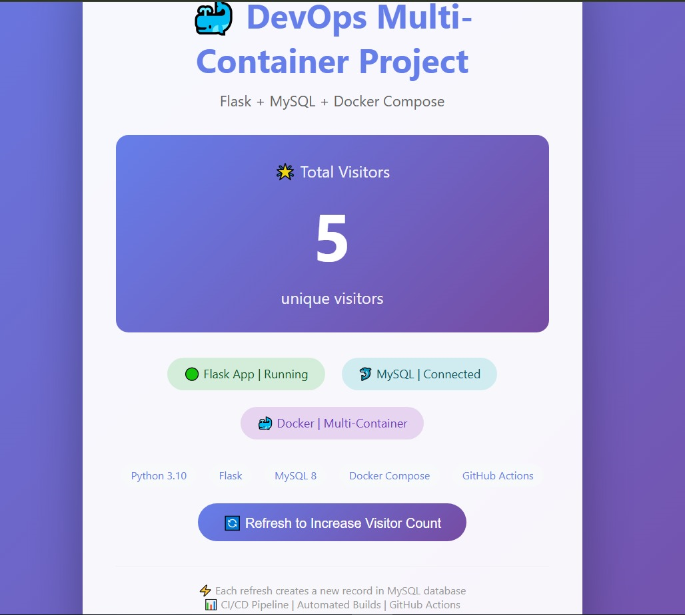
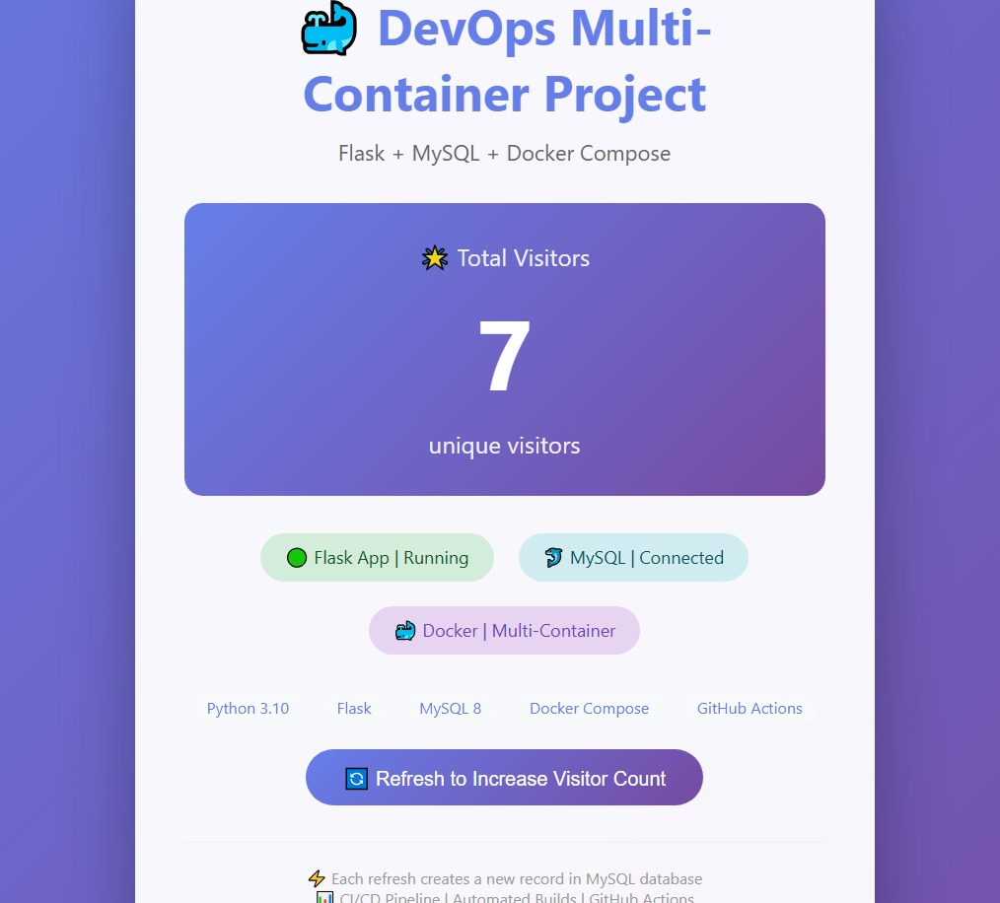
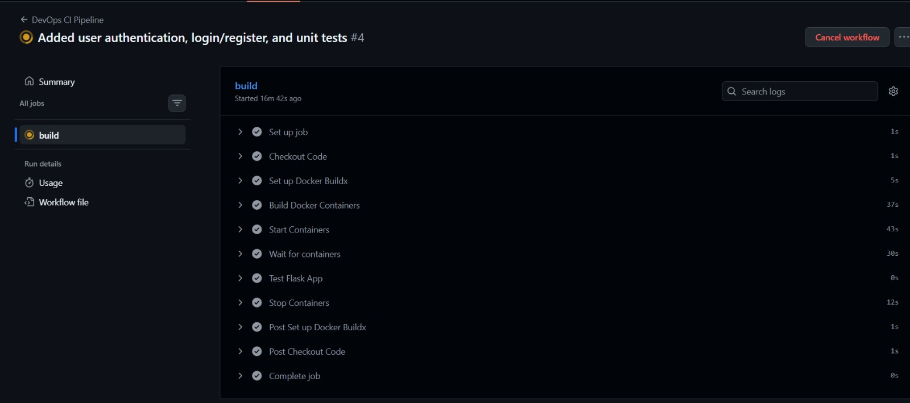

# 🐳 Multi-Container DevOps Project

## 📌 Project Overview

A complete DevOps project demonstrating a multi-container application with Flask, MySQL, Docker Compose, and CI/CD pipeline using GitHub Actions.

## 📸 Screenshots

## 🚀 Features Implemented

- ✅ User Authentication (Login/Register)
- ✅ Visitor Counter with MySQL Database
- ✅ Modern Responsive UI with Animations
- ✅ Docker Multi-Container Orchestration
- ✅ CI/CD Pipeline with GitHub Actions
- ✅ Automated Unit Tests with Pytest
- ✅ Health Checks and Retry Logic
- ✅ Form Validation and Flash Messages

## 📦 How to Run Locally

### Prerequisites
- Docker Desktop installed and running

### Step 1: Build and Run
docker compose up --build

### Step 2: Access the Application
Open your browser and go to: http://localhost:5000

### Step 3: Test the App
Register a new account

Login with your credentials

Refresh the page to increase visitor count

### Step 4: Stop the Application
docker compose down

## CI/CD Pipeline (GitHub Actions)
The pipeline automatically runs on every push to the main branch:

Checkout Code - Pulls latest code from GitHub

Set up Python - Installs Python 3.10

Install Dependencies - Installs required packages

Run Unit Tests - Executes pytest suite

Set up Docker Buildx - Prepares Docker environment

Build Containers - Builds Flask and MySQL images

Start Containers - Runs multi-container setup

Test Flask App - Verifies app responds

Stop Containers - Cleans up resources

## Project Structure
Devops-project/
├── app.py                 # Flask application with authentication
├── Dockerfile             # Docker configuration
├── docker-compose.yml     # Multi-container setup
├── requirements.txt       # Python dependencies
├── README.md              # Documentation
├── templates/
│   ├── index.html        # Homepage UI
│   ├── login.html         # Login page
│   └── register.html      # Registration page
├── tests/
│   └── test_app.py       # Unit tests
└── .github/
    └── workflows/
        └── ci.yml        # CI/CD pipeline

## 📊 Visitor Counter Logic
Each time you refresh the homepage:

A new visitor record is inserted into MySQL database

The total count is calculated using SQL COUNT(*)

The updated count is displayed on the UI in real-time

## 🛠️ Technologies Used
**Languages & Frameworks:** Python 3.10, Flask 2.3.0, HTML5, CSS3

**Database:** MySQL 8.0

**DevOps & Tools:** Docker, Docker Compose, GitHub Actions, Git

**Testing & Security:** Pytest, Flask-Login, Werkzeug
